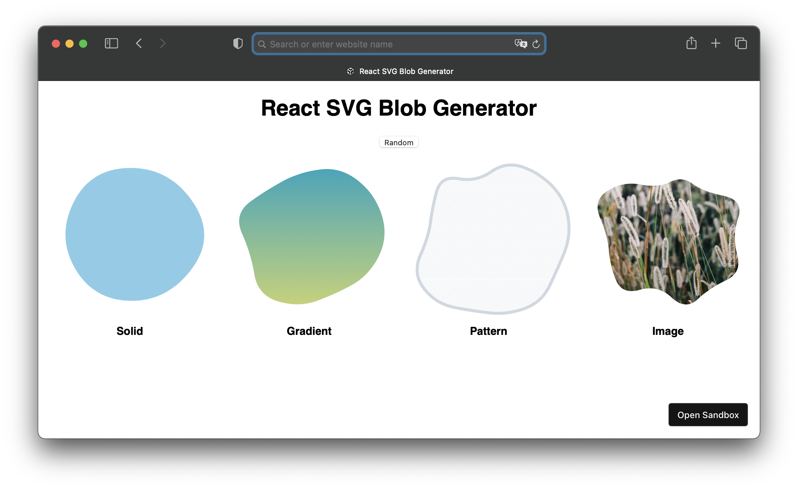

# REACT-SVG-BLOB

React SVG Blob Generator. Inspired by [blob shapes app](https://github.com/lokesh-coder/blobs.app) original

[](https://www.npmjs.com/package/react-svg-blob)
[](https://www.npmjs.com/package/react-svg-blob)

[](https://codesandbox.io/s/react-svg-blob-kuzpc)

## Demo

https://codesandbox.io/s/react-svg-blob-kuzpc

## Installation

```sh
$ yarn add react-svg-blob
```

## Usage

```jsx
import {SvgBlob} from 'react-svg-blob';
import {cross as crossPattern} from 'react-svg-blob/dist/lib/patterns';

<SvgBlob variant='solid' color='#00cec9' />;

<SvgBlob variant='gradient' colors={['#2980B9', '#6DD5FA']} />

<SvgBlob variant='pattern' pattern={crossPattern} color='#d1d8e0' isOutline />

<SvgBlob
  variant='image'
  image='https://source.unsplash.com/random/600x600/?plants'
/>
```

### Options

|    parameter     |               type                |   default   | description                                                                           |
| :--------------: | :-------------------------------: | :---------: | :------------------------------------------------------------------------------------ |
|     variant      | `solid\|gradient\|pattern\|image` | `undefined` | The variant type of shape. Required `true`                                            |
|    isOutline     |             `boolean`             |   `false`   |                                                                                       |
| shapeProps.size  |             `number`              |    `200`    | SVG blob path size                                                                    |
| shapeProps.grow  |             `number`              |     `6`     | Minimum size of the blob in percentage. More the smaller more the randomness          |
| shapeProps.edges |             `number`              |     `6`     | Total nodes to create a shape. Increasing this value will add complexity to the shape |
| shapeProps.seed  |             `number`              | `undefined` | It can be used to get same shape                                                      |

> We provide some patterns ready to use. You can find more of the pattern at [Hero Patterns](https://www.heropatterns.com/)

## Screenshot examples


## License

MIT
